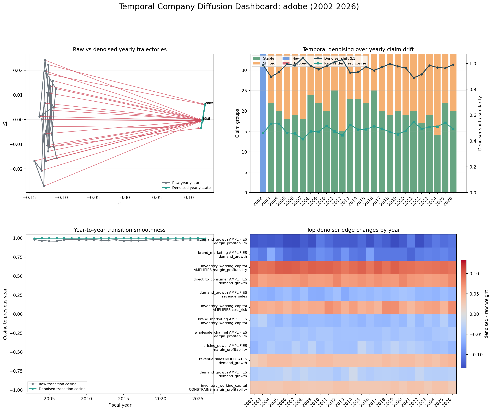

# Diffusion Trajectory

- Company: ADOBE
- Denoised blocks: 23

## Notes

# Temporal Company Diffusion Notes

## Largest denoiser shifts

- 2007: delta_l1=1.0429, cosine=0.4127, block_votes=3
- 2012: delta_l1=1.0290, cosine=0.4441, block_votes=3
- 2011: delta_l1=1.0117, cosine=0.4740, block_votes=3
- 2018: delta_l1=0.9972, cosine=0.4696, block_votes=3
- 2005: delta_l1=0.9960, cosine=0.4633, block_votes=3
- 2026: delta_l1=0.9912, cosine=0.4920, block_votes=1

## Most conservative years

- 2021: cosine=0.5488, delta_l1=0.8889
- 2025: cosine=0.5411, delta_l1=0.9636
- 2004: cosine=0.5321, delta_l1=0.9329
- 2003: cosine=0.5317, delta_l1=0.8962
- 2013: cosine=0.5255, delta_l1=0.9290
- 2010: cosine=0.5170, delta_l1=0.9795

## Most altered years

- 2007: cosine=0.4127, delta_l1=1.0429
- 2012: cosine=0.4441, delta_l1=1.0290
- 2019: cosine=0.4511, delta_l1=0.9771
- 2006: cosine=0.4581, delta_l1=0.9845
- 2002: cosine=0.4615, delta_l1=0.9877
- 2005: cosine=0.4633, delta_l1=0.9960
