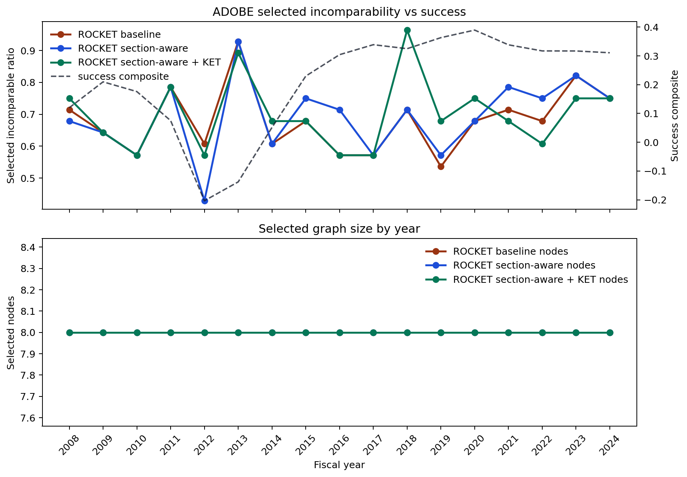

# PSR Drilldown

- Company: ADOBE
- This Markdown companion is included so GitHub can render the PSR snapshot directly.

## Timeline

## ROCKET Score Summary

| Variant | Ranking score | Effect label |
| --- | --- | --- |
| ROCKET baseline | -0.766 | inconclusive |
| ROCKET section-aware | 0.145 | inconclusive |
| ROCKET section-aware + KET | -0.080 | inconclusive |

## Year Table

| Year | Success | Baseline incomparability | Section-aware incomparability | KET incomparability | Baseline nodes | Section-aware nodes | KET nodes |
| --- | --- | --- | --- | --- | --- | --- | --- |
| 2008 | 0.120 | 0.714 | 0.679 | 0.750 | 8.000 | 8.000 | 8.000 |
| 2009 | 0.210 | 0.643 | 0.643 | 0.643 | 8.000 | 8.000 | 8.000 |
| 2010 | 0.176 | 0.571 | 0.571 | 0.571 | 8.000 | 8.000 | 8.000 |
| 2011 | 0.075 | 0.786 | 0.786 | 0.786 | 8.000 | 8.000 | 8.000 |
| 2012 | -0.203 | 0.607 | 0.429 | 0.571 | 8.000 | 8.000 | 8.000 |
| 2013 | -0.138 | 0.929 | 0.929 | 0.893 | 8.000 | 8.000 | 8.000 |
| 2014 | 0.051 | 0.607 | 0.607 | 0.679 | 8.000 | 8.000 | 8.000 |
| 2015 | 0.230 | 0.679 | 0.750 | 0.679 | 8.000 | 8.000 | 8.000 |
| 2016 | 0.304 | 0.571 | 0.714 | 0.571 | 8.000 | 8.000 | 8.000 |
| 2017 | 0.339 | 0.571 | 0.571 | 0.571 | 8.000 | 8.000 | 8.000 |
| 2018 | 0.325 | 0.714 | 0.714 | 0.964 | 8.000 | 8.000 | 8.000 |
| 2019 | 0.363 | 0.536 | 0.571 | 0.679 | 8.000 | 8.000 | 8.000 |
| 2020 | 0.390 | 0.679 | 0.679 | 0.750 | 8.000 | 8.000 | 8.000 |
| 2021 | 0.338 | 0.714 | 0.786 | 0.679 | 8.000 | 8.000 | 8.000 |
| 2022 | 0.317 | 0.679 | 0.750 | 0.607 | 8.000 | 8.000 | 8.000 |
| 2023 | 0.317 | 0.821 | 0.821 | 0.750 | 8.000 | 8.000 | 8.000 |
| 2024 | 0.311 | 0.750 | 0.750 | 0.750 | 8.000 | 8.000 | 8.000 |

## PSR baseline

| Context | Test | Eval years | p(true) | p(false) | Gap | Brier |
| --- | --- | --- | --- | --- | --- | --- |
| Operations | manufacture -> optimize => revenue_up | 5 | 0.292 | 0.407 | -0.115 | 0.300 |
| Operations | manufacture -> optimize => margin_up | 5 | 0.217 | 0.333 | -0.115 | 0.211 |

## PSR max length 3

| Context | Test | Eval years | p(true) | p(false) | Gap | Brier |
| --- | --- | --- | --- | --- | --- | --- |
| Operations | manufacture => free_cash_flow_up | 6 | 0.297 | 0.372 | -0.075 | 0.257 |
| Operations | manufacture => leverage_down | 6 | 0.211 | 0.286 | -0.075 | 0.172 |

## PSR section-aware

| Context | Test | Eval years | p(true) | p(false) | Gap | Brier |
| --- | --- | --- | --- | --- | --- | --- |
| Operations | digitize -> manufacture => revenue_up | 3 | 0.231 | 0.349 | -0.118 | 0.278 |
| Operations | digitize -> manufacture => free_cash_flow_up | 3 | 0.210 | 0.327 | -0.118 | 0.280 |
