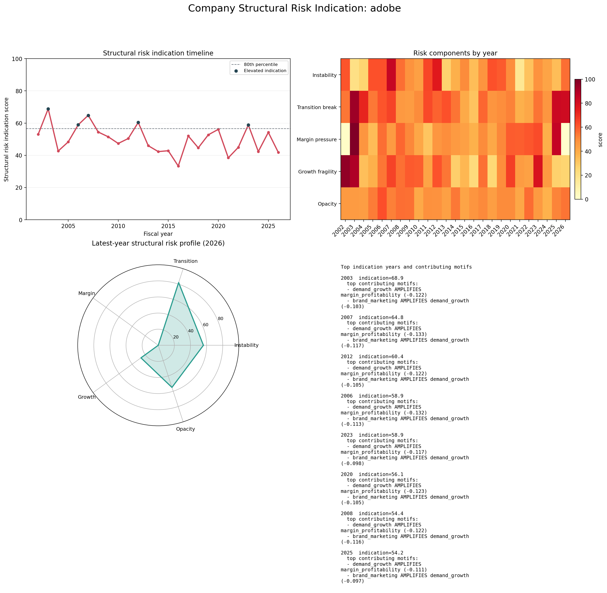

# Structural Risk Radar

- Company: ADOBE

## Summary

# Company Structural Risk Indication Summary

- Years analysed: 2002-2026
- Mean structural risk indication score: 50.04
- Peak indication year: 2003 (68.86)
- Lowest indication year: 2016 (33.31)

## Highest-indication years

- 2003: indication=68.86, instability=20.44, margin_pressure=100.00, growth_fragility=89.93
  warning motifs: demand_growth AMPLIFIES margin_profitability (-0.122) | brand_marketing AMPLIFIES demand_growth (-0.103) | inventory_working_capital AMPLIFIES margin_profitability (+0.088) | demand_growth AMPLIFIES revenue_sales (-0.063) | direct_to_consumer AMPLIFIES demand_growth (+0.058) | inventory_working_capital AMPLIFIES cost_risk (+0.052) | wholesale_channel AMPLIFIES margin_profitability (-0.049) | pricing_power AMPLIFIES margin_profitability (-0.048)
- 2007: indication=64.81, instability=84.21, margin_pressure=45.25, growth_fragility=65.12
  warning motifs: demand_growth AMPLIFIES margin_profitability (-0.133) | brand_marketing AMPLIFIES demand_growth (-0.117) | inventory_working_capital AMPLIFIES margin_profitability (+0.099) | direct_to_consumer AMPLIFIES demand_growth (+0.066) | demand_growth AMPLIFIES revenue_sales (-0.063) | brand_marketing AMPLIFIES inventory_working_capital (-0.060) | inventory_working_capital AMPLIFIES cost_risk (+0.055) | wholesale_channel AMPLIFIES margin_profitability (-0.049)
- 2012: indication=60.38, instability=75.78, margin_pressure=46.64, growth_fragility=61.58
  warning motifs: demand_growth AMPLIFIES margin_profitability (-0.122) | brand_marketing AMPLIFIES demand_growth (-0.105) | inventory_working_capital AMPLIFIES margin_profitability (+0.094) | direct_to_consumer AMPLIFIES demand_growth (+0.079) | inventory_working_capital AMPLIFIES cost_risk (+0.065) | brand_marketing AMPLIFIES inventory_working_capital (-0.060) | demand_growth AMPLIFIES revenue_sales (-0.050) | pricing_power AMPLIFIES margin_profitability (-0.050)
- 2006: indication=58.91, instability=61.77, margin_pressure=56.15, growth_fragility=54.63
  warning motifs: demand_growth AMPLIFIES margin_profitability (-0.132) | brand_marketing AMPLIFIES demand_growth (-0.113) | inventory_working_capital AMPLIFIES margin_profitability (+0.102) | direct_to_consumer AMPLIFIES demand_growth (+0.064) | demand_growth AMPLIFIES revenue_sales (-0.053) | brand_marketing AMPLIFIES inventory_working_capital (-0.049) | pricing_power AMPLIFIES margin_profitability (-0.047) | inventory_working_capital AMPLIFIES cost_risk (+0.045)
- 2023: indication=58.86, instability=47.90, margin_pressure=63.00, growth_fragility=78.17
  warning motifs: demand_growth AMPLIFIES margin_profitability (-0.117) | brand_marketing AMPLIFIES demand_growth (-0.098) | inventory_working_capital AMPLIFIES margin_profitability (+0.088) | direct_to_consumer AMPLIFIES demand_growth (+0.061) | inventory_working_capital AMPLIFIES cost_risk (+0.059) | demand_growth AMPLIFIES revenue_sales (-0.058) | wholesale_channel AMPLIFIES margin_profitability (-0.051) | pricing_power AMPLIFIES margin_profitability (-0.046)
- 2020: indication=56.10, instability=49.83, margin_pressure=59.60, growth_fragility=66.40
  warning motifs: demand_growth AMPLIFIES margin_profitability (-0.123) | brand_marketing AMPLIFIES demand_growth (-0.105) | inventory_working_capital AMPLIFIES margin_profitability (+0.092) | direct_to_consumer AMPLIFIES demand_growth (+0.078) | brand_marketing AMPLIFIES inventory_working_capital (-0.058) | inventory_working_capital AMPLIFIES cost_risk (+0.053) | demand_growth AMPLIFIES revenue_sales (-0.047) | wholesale_channel AMPLIFIES margin_profitability (-0.044)
- 2008: indication=54.45, instability=56.02, margin_pressure=57.50, growth_fragility=55.70
  warning motifs: demand_growth AMPLIFIES margin_profitability (-0.122) | brand_marketing AMPLIFIES demand_growth (-0.116) | inventory_working_capital AMPLIFIES margin_profitability (+0.094) | direct_to_consumer AMPLIFIES demand_growth (+0.072) | brand_marketing AMPLIFIES inventory_working_capital (-0.060) | demand_growth AMPLIFIES revenue_sales (-0.051) | inventory_working_capital AMPLIFIES cost_risk (+0.049) | pricing_power AMPLIFIES margin_profitability (-0.044)
- 2025: indication=54.23, instability=33.85, margin_pressure=84.97, growth_fragility=27.50
  warning motifs: demand_growth AMPLIFIES margin_profitability (-0.111) | brand_marketing AMPLIFIES demand_growth (-0.097) | inventory_working_capital AMPLIFIES margin_profitability (+0.092) | direct_to_consumer AMPLIFIES demand_growth (+0.065) | demand_growth AMPLIFIES revenue_sales (-0.054) | pricing_power AMPLIFIES margin_profitability (-0.047) | inventory_working_capital AMPLIFIES cost_risk (+0.046) | wholesale_channel AMPLIFIES margin_profitability (-0.042)

## Calibration

- Unsupervised early-warning mode. no labels provided

## Notes

# Company Structural Risk Indication Notes

## Highest-indication years

- 2003: indication=68.86, instability=20.44, margin=100.00, growth=89.93
- 2007: indication=64.81, instability=84.21, margin=45.25, growth=65.12
- 2012: indication=60.38, instability=75.78, margin=46.64, growth=61.58
- 2006: indication=58.91, instability=61.77, margin=56.15, growth=54.63
- 2023: indication=58.86, instability=47.90, margin=63.00, growth=78.17
- 2020: indication=56.10, instability=49.83, margin=59.60, growth=66.40

## Lowest-indication years

- 2016: indication=33.31, instability=33.60, margin=37.65, growth=23.41
- 2021: indication=38.42, instability=16.41, margin=59.27, growth=44.63
- 2026: indication=41.78, instability=56.06, margin=0.00, growth=26.54
- 2014: indication=42.29, instability=38.20, margin=45.65, growth=28.31
- 2024: indication=42.32, instability=41.92, margin=38.55, growth=45.38
- 2004: indication=42.64, instability=26.35, margin=47.19, growth=33.56
